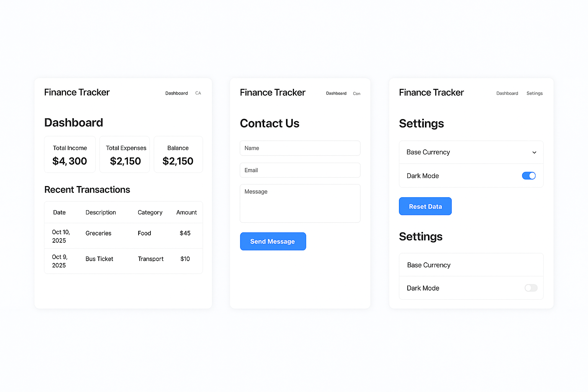

# 🎓 Student Finance Tracker

A simple, responsive, and user-friendly web application designed to help students manage their income and expenses efficiently.  
The **Student Finance Tracker** allows users to record daily transactions, visualize spending habits with charts, and customize settings — all stored locally in the browser using `localStorage`.

---

## 🗂 Project Structure

```
index.html
│
├───jsScripts
│       contact.js
│       dashboard.js
│       setting.js
│       transaction.js
│
├───pages
│       contact.html
│       dashboard.html
│       setting.html
│       transactions.html
│
└───styles
        dashboard.css
        index.css
        setting.css
        transaction.css
```

---

## ✨ Features

### 📊 Dashboard
- Introduces the platform and summarizes your financial data.  
- Displays charts for income vs expenses trends.  
- Responsive layout with smooth navigation.

### 💰 Transactions
- Add, view, and search transactions.  
- Automatically calculates **total income**, **total expenses**, and **balance**.  
- Data is saved locally in `localStorage`.  
- Includes live **Chart.js** graphs to visualize spending by category or type.

### 🛠 Settings
- Configure currency and category preferences.  
- Import/export data in JSON format.  
- Option to reset stored data.

### 💬 Contact Us
- Simple feedback form where users can submit reviews.  
- Stored locally and displayed dynamically on the same page.

---

## 🧱 Technologies Used

- **HTML5** — Structure and semantics  
- **CSS3** — Responsive styling  
- **JavaScript (Vanilla)** — Logic and DOM manipulation  
- **Chart.js** — Data visualization  
- **LocalStorage API** — Persistent data management  

---

## 🚀 How to Run the Project

1. **Download or Clone** this repository:
   ```bash
   git clone https://github.com/boaziza/student-finance-tracker.git
   ```
2. Open the project folder in VS Code or your preferred editor.  
3. Launch with **Live Server** (recommended) or open `index.html` directly in your browser.

---

## 📱 Responsiveness

- Fully optimized for both **desktop** and **mobile** screens.  
- Navbar collapses into a hamburger menu on smaller devices.  
- Cards, tables, and forms auto-adjust to screen width.

---

## 🎥 Tutorial Reference

This project follows the YouTube tutorial:  
▶️ [Personal Finance Tracker - Full Project Guide](https://youtu.be/zXwJp31veso)

Use it as a visual reference for structure, UI, and interactions.

---

## 🧩 Detailed JavaScript Overview

### 🟩 `transaction.js`
Handles:
- Adding and saving **income/expense** entries.  
- Automatically recalculating total income, expenses, and balance.  
- Rendering all transactions in an HTML table.  
- Drawing **doughnut charts** with Chart.js to show income vs. expenses.  
- Performing **regex-based search** with optional case sensitivity.  
- Enabling **sorting** by clicking table headers (date, description, amount, etc.).  
- Syncs automatically with the settings page to load custom categories and currency.

### 🟦 `setting.js`
Handles:
- Managing **currencies**, **exchange rates**, and **custom categories**.  
- Auto-saving configuration to `localStorage` on blur events.  
- Exporting all saved transactions as a downloadable `.json` file.  
- Importing valid JSON transaction files (with input validation).  
- Resetting all app data including transactions and preferences.  
- Displays feedback and status messages when actions are completed.

---

## 🧮 Data Models

### Transaction Example
```json
{
  "id": "transaction_1697288212000",
  "date": "2025-10-15",
  "description": "Lunch at Cafe",
  "accounts": "expense",
  "amount": 12,
  "currency": "USD",
  "category": "Food"
}
```

### Settings Example
```json
{
  "baseCurrency": "USD",
  "currency1": { "code": "EUR", "rate": 0.93 },
  "currency2": { "code": "RWF", "rate": 1300 },
  "categories": ["Food", "Transport", "Books", "Other"]
}
```

---

## ⚙️ Validation Rules

- **Category** → letters, spaces, and hyphens only.  
- **Currency Code** → 3 uppercase letters (e.g., USD, EUR, RWF).  
- **Rate** → numeric, up to 4 decimal places.  
- **Date** → format `YYYY-MM-DD`.  
- **Amount** → must be a number.  

---

## 📤 Export & Import

### Export
- Collects all `transaction_` records from `localStorage`.  
- Downloads them as `finance-data.json`.

### Import
- Accepts valid JSON files containing transaction arrays.  
- Validates:
  - IDs  
  - Dates  
  - Amounts  
  - Descriptions  
- Displays import errors clearly on the settings page.

---

## 🔄 Reset Option
The **Reset** button completely clears:
- All `transaction_*` records  
- The “exp” summary object  
- Currency and category preferences  
- Restores default categories (`Food`, `Books`, `Transport`, `Entertainment`, `Fees`, `Other`)

---

## 🖼️ Wireframe Overview

### Dashboard Page
- Header with collapsible menu  
- Summary section showing income, expenses, and balance  
- Transaction table  
- Doughnut chart below the table  
- Add Transaction form (date, description, amount, account, category)

### Settings Page
- Currency and category configuration section  
- Add/remove category list  
- Export and import controls  
- Reset and save buttons  
- Status message area at bottom  

---

## 🧠 Concepts Demonstrated

- Local data persistence using browser storage  
- Dynamic DOM manipulation  
- Regex-based input validation  
- JSON serialization & file handling  
- Data sorting and filtering  
- Chart.js visualization  
- Event delegation and modular scripting  

---

## 📈 Future Improvements

- Add user authentication (Appwrite / Firebase).  
- Support recurring transactions.  
- Integrate real-time currency conversion API.  
- Generate downloadable PDF reports.

---

## 👨‍💻 Author

**Prince Boaz Iza**  
GitHub: [@boaziza](https://github.com/boaziza)  
Email: [b.iza@alustudent.com](mailto:b.iza@alustudent.com)

---
## Wireframe

## 🪪 License

This project is open-source and available under the **MIT License**.
